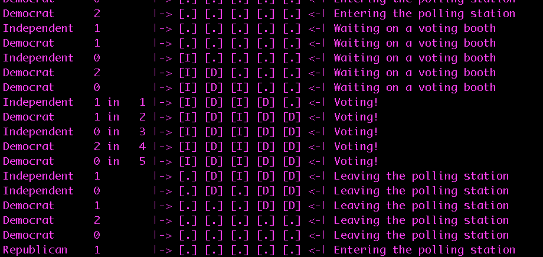

# CS441/541 Project 5

## Author(s):

Kala Arentz, Ben Klipfel


## Date:

March 27, 2018


## Description:

This program will be dealing with synchronization and an election polling station. A new rule implemented will mean that all Democrats and Republican's cannot be in the voting booths at the same time. If a person voting is an independent voter, they can vote whenever a Democrat or Republican is voting. This is meant to sway the Independent to a specific party.

The program will create a requisite number of Republicans, Independents, and Democrat threads. The program will have four arguments, all optional, in the following order.  
  1. Number of polling stations, OPTIONAL. Default is 10.  
  2. Number of Republicans, OPTIONAL. Default is 5.  
  3. Number of Democrats, OPTIONAL. Default is 5.  
  4. Number of Independents, OPTIONAL. Default is 5.  
  *** All these arguments need to be greater than 0!  

After threads are created, the threads must wait a whole TWO seconds before opening the polling station. Once the station is open, the voters can line up.

During the program, the voter will need to print a message. The following information is required to be printed: The political party, the identifier (0-N).  
  - waiting for polling station to open  
  - enters the polling station and sign-ins at the registration desk  
  - starts waiting on the first available voting booth  
  - enters a voting booth, and identifying which voting booth it entered  
  - leaves the voting booth and polling station  


## How to build the software

Run the command

```
make  
```
If no errors or warnings are displayed, the following output will be displayed on the console:  
```
gcc -Wall -g -O0 -I../lib   -c -o ../lib/semaphore_support.o ../lib/semaphore_support.c
gcc -o finicky-voter finicky-voter.c ../lib/semaphore_support.o -Wall -g -O0 -I../lib -pthread
```  
Before adding to github, always run the command  
```
make clean
```  
If no errors are created, the folling message will be printed to the console  
```
rm -f finicky-voter *.o
rm -f -rf *.dSYM
cd ../lib && make clean
rm -f sum *.o
rm -f -rf *.dSYM
```


## How to use the software

To run the program, you will run the command:  

```
./finicky-voter
```
This will run the program with the default parameters of ten booths, five republicans, five democrats, and five independent voters.  

If you want to increase or decrease any of these numbers, you need to follow the order of parameters discussed earlier. The program will have four arguments, all optional, in the following order.  
  1. Number of polling stations, OPTIONAL. Default is 10.  
  2. Number of Republicans, OPTIONAL. Default is 5.  
  3. Number of Democrats, OPTIONAL. Default is 5.  
  4. Number of Independents, OPTIONAL. Default is 5.  
  *** All these arguments need to be greater than 0!  

For example:
```
./finicky-voter 5 5 2 3
```  
This will have five booths, five republicans, two democrats, and three independent voters.  

## How the software was tested

###### Parameter Testing
If any of the parameters passed are below 0, the console will output an error. For example:  

```
./finicky-voter 4 4 -4 2
```  

The error displayed will be:  

```
Error: the number of Democrats must be greater than 0!
```  

## Known bugs and problem areas

1. A possible problem with the index; where it over writes the current person in the booth, (do not want to make a function that returns a index by checking each state of booth - can be too aggressive in the VOTING condition)  
2. An error where printing off people in the booths before they were technically in the booths; picture attached that shows this error, it does not occur every single time  


## Special Section

##### 1. Describe your solution to the problem in words.
We definitely used the Unisex Bathroom as a starting basis for our problem. We wanted to have a counting semaphore for our booths, because we only had a certain amount of booths, and these types of semaphores can be thought of as a queue of a certain length. We included an empty semaphore so we can help determine when voters can vote. This helps with the condition of Democrats and Republicans can not vote at the same time.

We created a struct voter that is held in a array. This struct holds the political party of the voter, their status, the thread id, and the current booth index they are in if they are voting. These were added to when we created the threads, since we already knew the total number of voters.

We had two different enum's that hold information. We used an enum to create the type of Political Party they are involved with and the type of status they have.  
    1. OPENING: the polling station is opening.  
    2. ENTERING: the voter is entering the polling station  
    3. WAITING: the voter is waiting for a booth  
    4. VOTING: the voter is voting!  
    5. LEAVING: they are exiting the polling stations  
    6. DONE: This is so we know they are done, and will no longer print any information to the screen  
    7. CANT_VOTE: This is for when a voter is waiting on a booth to vote, but they cannot vote because the booths are full.  

We had three different thread arrays that hold all the threads. Each of the thread arrays were the length of the number of political party members voting. The Republicans and Democrats had similar functions, and the Independents had the most different one.

The Republicans and Democrats functions followed the same pattern:  
    1. a busy_wait_function which helped to simulate the waiting of two seconds before the polling station could open. This function included a semaphore so only one thread could change the busy_wait variable, which allowed only one thread to sleep for two seconds, and the rest would just have a while loop that did nothing  
    2. A semaphore for each political party helped keep the count numbers and the voter struct from being accessed and changed by multiple threads (THIS PART WAS BASED OFF THE UNISEX BATHROOM).  
    3. The main function that changed the status of the voters was in the determine_status().  

The Independent functions had the structure of:  
    1. A semaphore to keep the independent count and accessing a specific voter from being accessed by other independent threads  
    2. Call of the determine_status() function.  
    *** This one did not have a lot of requirements because it does not matter who they vote with.    

The determine_status function is a long if statement, that depending on the status of the voter, we will do certain functions or actions. All the statuses will have the print_current_status which will print the statement that shows on the console.


##### 2. How does your solution avoid deadlock?

Our use of semaphores not only prevents republicans and democrats from being in line/voting at the same time, but it also makes sure that only one can print its status at a time. For example, if a Republican wants to cast its vote, it must first see if a democrat is in the booth, then it must see if there is an open booth, then it checks on a lock to see if it is allowed to print. This multitude of semaphores, especially the printing, prevents multiple voters from being stuck in the critical section.


##### 3. How does your solution prevent Republican and Democrat voters from waiting on a voting booth at the same time?

We use the idea of a "turn-style" from the Lil' book of semaphores. For example, if the democrat count is ever 1, we lock republicans from entering the line. If the democrat count is ever below 1, we open the booths back up. Same for republicans but vice-versa.

##### 4. How is your solution "fair"? How are you defining "fairness" for this problem?

For this problem, fairness means that there will be no threads pre-empting each other, and the voters enter the booths in the same order they wait for the booths.

We implemented this by making sure that the voters voted in the exact same order that they waited on a voting booth in. For example, a Republican will never pre-empt an Independent despite it not coming from a "major party."
When a voter struct enters the critical section their waiting status is immediately changed to voting.

##### 5. How does your solution prevent starvation? How are you defining "starvation" for this problem?

In this case, starvation would be preventing a voter from ever entering a voting booth. We prevent this by only
locking out Republicans and Democrats just based on the type of voter, which means that independents don't care about the other
voters parties, and by using our "turn-style" we again we allow both republicans and democrats a fair chance to vote.
